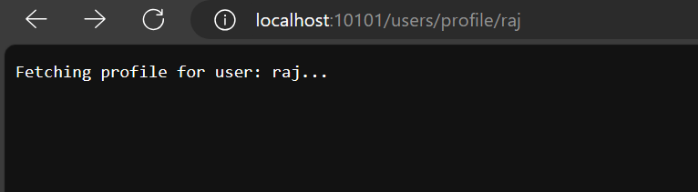

# go-graceful-restapi-server
 A simple yet robust RESTful API web server built with Go, featuring graceful shutdown capabilities for seamless operation.
- `The server is designed to handle HTTP requests, providing a foundation for building scalable and maintainable API-based applications.`


# Go HTTP Server with Graceful Shutdown

This is a simple Go HTTP server example using the httprouter package with graceful shutdown capabilities.

## Getting Started

1. Clone this repository:

   ```bash
   git clone https://github.com/prudhvirajstark/go-graceful-restapi-server
   cd go-graceful-restapi-server
   ```


2. Run the server

    ```bash
    go run ./app/main.go
    ```
The server will start on http://localhost:10101.


## Endpoints


***- GET /users/profile/:username***

Returns a message indicating that the server is fetching the profile for the specified username.


- http://localhost:10101/users/profile/raj




